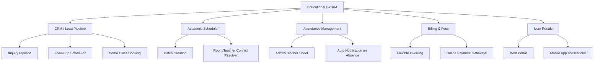

# Product Requirements Document (PRD)
## Project Name: Educational E-CRM & Classes Management System

---

## 1. Document Control
*   **Version**: 1.0.0
*   **Status**: Proposal / Draft
*   **Authors**: Antigravity AI & Dharmendra
*   **Target Release**: Q3 2026

---

## 2. Executive Summary & Vision

Coaching centers, academies, and private instructors often struggle with fragmented administrative tasks, scattered communication, and inefficient lead tracking. They rely on separate spreadsheets for student lists, calendars for schedules, WhatsApp for alerts, and physical logs for attendance and payments.

**Educational E-CRM** is a unified, cloud-ready, premium management platform that streamlines the entire student lifecycle: from initial lead acquisition and demo scheduling, through enrollment, attendance, scheduling, fee tracking, and direct communication.

### Product Goals:
*   **For Admins**: Increase lead conversion rates, minimize fee leakages, and automate time-consuming reporting tasks.
*   **For Teachers**: Provide a quick, frictionless way to take attendance, track schedules, and log performance.
*   **For Students & Parents**: Provide a transparent portal to track schedules, monitor attendance, pay fees, and communicate with instructors.
*   **Platform Coverage**: A web application optimized for desktop administration and client portals, alongside a mobile application (iOS & Android) designed for quick admin lookups, teacher schedules/attendance, and parent/student updates.

---

## 3. User Personas & Target Audience

| Persona | Role | Key Goals & Needs | Primary Platform |
| :--- | :--- | :--- | :--- |
| **System Administrator / Academy Owner** | Core Admin | • Monitor billing, payments, and pipeline metrics. • Manage teacher assignments and student registration. • Export reports for compliance and taxes. | Web Dashboard |
| **Teacher / Instructor** | Tutor | • View assigned batches and schedules. • Mark class attendance quickly. • Log grades, assignments, and behavior comments. | Web / Mobile (Quick view) |
| **Student** | Learner | • View weekly schedules and test results. • Submit assignments and view lecture materials. • Track outstanding fees. | Mobile / Web Portal |
| **Parent** | Guardian | • Monitor attendance and behavioral progress of minor students. • Review and pay fee invoices online. • Receive notifications about emergencies or absences. | Mobile App (Main) / Web Portal |

---

## 4. Key Feature Domains & Functional Scope

### 4.1. Lead Management CRM (Admins)
*   **Kanban Board**: Drag-and-drop workflow tracker (New Lead $\rightarrow$ Contacted $\rightarrow$ Demo Scheduled $\rightarrow$ Enrolled $\rightarrow$ Lost).
*   **Inquiry Form**: Public-facing embeddable web form to capture new leads automatically.
*   **Follow-Up Reminders**: Automated dashboard alerts to remind admins to contact leads.
*   **Demo Scheduler**: Schedule trial/demo sessions with automatic email/SMS confirmation to the lead and teacher.

### 4.2. Class & Batch Scheduler (Admins & Teachers)
*   **Batch Creation**: Define subjects, start/end dates, max capacity, and course fees.
*   **Timetable Grid**: Calendar interface showing class schedules, teacher allocations, and classroom locations.
*   **Conflict Prevention**: Automatic warning system preventing a teacher or room from being double-booked at the same time.

### 4.3. Student & Staff Directory (Admins)
*   **Dynamic Profiles**: Detailed dossiers containing contact details, emergency contacts, enrollment history, attendance rate, payment logs, and private administrative notes.
*   **Bulk Operations**: Bulk upload students/teachers via CSV and bulk enroll them into batches.

### 4.4. Attendance Tracker (Teachers & Admins)
*   **Quick Attendance Sheet**: Simple grid list with filters (date, batch) to mark Present/Absent/Late with a single tap.
*   **Absence Alerts**: Auto-generated alerts triggered when a student is marked absent (sent to parents via email, SMS, or Push Notification).
*   **Analytics**: Historical records tracking individual and batch-wide attendance percentages.

### 4.5. Fee & Invoice Management (Admins, Parents, Students)
*   **Fee Structures**: Create custom templates (e.g., Monthly: $100/mo; Term-based: $500/6-months; One-time: $1000).
*   **Invoicing**: Automatically generate monthly or custom invoices and send them as PDF links via email.
*   **Payment Ledger**: Track paid, partially paid, and unpaid statuses. Support recording of offline payments (Cash/Cheque/Bank Transfer).
*   **Gateway Integration**: Online payments via Stripe/Razorpay (Web & Mobile).

### 4.6. Multi-Platform Support (Web & Mobile)
*   **Web App**: Fully featured application containing all administration modules, advanced CRM pipelines, database management, and billing dashboards.
*   **Mobile App (Native / Cross-Platform)**:
    *   *For Teachers*: Quick attendance marking, check upcoming schedules, message parents.
    *   *For Parents/Students*: Dashboard displaying attendance, grades, invoice alerts, push notifications for class changes, and Stripe/Razorpay quick pay.

---

## 5. Non-Functional Requirements (NFRs)

### 5.1. Security & Compliance
*   **Role-Based Access Control (RBAC)**: Fine-grained access level controls (Admins see billing and leads; Teachers see schedules and student records; Students/Parents see only their own accounts).
*   **Encryption**: HTTPS/TLS for all transit data; encryption at rest for database records.
*   **Compliance**: GDPR/COPPA compatibility since the system handles minor student records (parent consent flows, data access requests).

### 5.2. Performance & Scalability
*   **Page Load Time**: Under 2 seconds for primary dashboard panels on typical broadbands.
*   **API Response Times**: API endpoints must respond in $< 300\text{ ms}$ under 50 concurrent requests.
*   **Concurrency**: Support up to 1,000 active concurrent connections (Web + Mobile).

### 5.3. Usability & Accessibility
*   **Responsive Web Design**: Fluid layout matching sizes from 360px mobile viewports to ultra-wide desktop monitors.
*   **Offline Mode (Mobile App)**: Cache student lists and schedules locally, enabling teachers to mark attendance offline and sync it automatically once internet is restored.

---

## 6. Out of Scope (Phase 1)
*   *Native video conferencing system*: Instead, support pasting Zoom, Teams, or Google Meet links.
*   *Full accounting software integration*: Only track fee collection and simple invoice receipts; standard accounting reports (profit & loss sheets) can be generated by exporting CSVs to external software.
*   *Multi-branch operations*: Focus on single-branch academies initially, with a future migration path to multi-center management.
