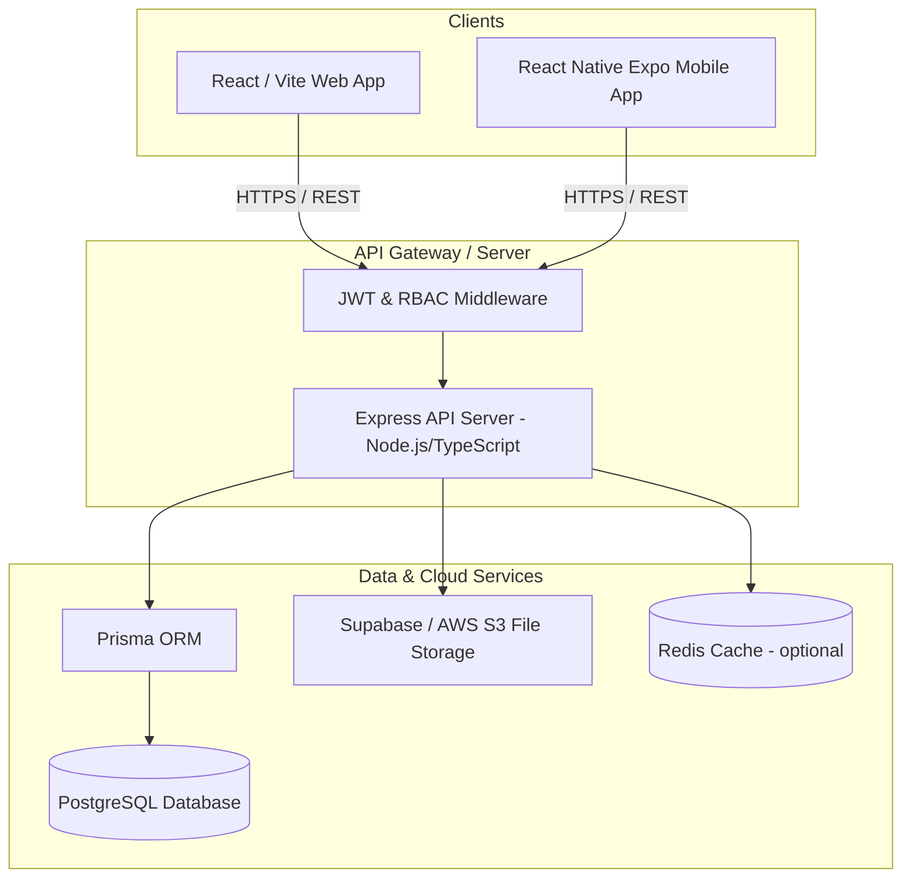

# Technical Requirements Document (TRD)
## Project Name: Educational E-CRM & Classes Management System

---

## 1. Document Control
*   **Version**: 1.0.0
*   **Status**: Draft
*   **Authors**: Antigravity AI & Dharmendra

---

## 2. System Architecture

The Educational E-CRM system utilizes a decoupled Client-Server architecture. Both Web and Mobile client applications consume a shared REST API gateway.



---

## 3. Technology Stack

### 3.1. Frontend (Web Application)
*   **Framework**: **React 18+** with **Vite** (for fast builds and minimal configuration).
*   **Routing**: **React Router DOM v6** (declarative client-side routing).
*   **State Management**: **Zustand** (lightweight state) or **React Context API** (minimizing bundle size).
*   **Data Fetching & Caching**: **TanStack Query (React Query)** to handle caching, background refetching, and synchronous state synchronization between client and server.
*   **Styling**: **Vanilla CSS** with global design variables, glassmorphic visual tokens, and custom keyframe animations.
*   **Icons**: **Lucide React** for modern, uniform SVG icons.

### 3.2. Frontend (Mobile Application)
*   **Framework**: **React Native** via **Expo** (allows sharing TypeScript interfaces, validation logic, and utility functions with the React web app).
*   **Navigation**: **Expo Router** (file-based routing equivalent to Next.js, matching the Web App's navigation model).
*   **Styling**: **React Native StyleSheet** or **NativeWind** (if Tailwind is preferred, but custom style modules are recommended for unity).
*   **Secure Storage**: **Expo SecureStore** for storing JWT and encryption keys securely.
*   **Local DB (Offline Cache)**: **WatermelonDB** or **SQLite** (Expo SQLite) for offline-first attendance taking and timetable availability.

### 3.3. Backend Server
*   **Runtime Environment**: **Node.js (LTS v20+)**.
*   **Language**: **TypeScript** (ensuring type safety from database models down to API routes).
*   **Framework**: **Express.js** (lightweight, flexible routing).
*   **Database ORM**: **Prisma** (provides a type-safe database client and automated migration tooling).
*   **Logging & Monitoring**: **Winston** combined with **Morgan** for detailed HTTP logging.

### 3.4. Database & Storage
*   **Primary Database**: **PostgreSQL** (supports relational integrity, complex JOIN queries for schedules/billing, and ACID compliance for transaction safety).
*   **Object Storage**: **AWS S3** or **Supabase Storage** (storing student/staff profile pictures, invoice PDFs, homework submissions).

---

## 4. Key Technical System Workflows

### 4.1. Authentication Flow (JWT)
1.  **Client Login**: User submits credentials to `/api/v1/auth/login`.
2.  **Verification**: Server checks password hash (bcrypt).
3.  **Token Generation**: Server signs a short-lived **Access Token** (JWT, 15 min expiry) and a long-lived **Refresh Token** (stored in DB/Redis, 7 days expiry).
4.  **Delivery**:
    *   *Web*: Access Token returned in JSON body; Refresh Token sent via `HttpOnly`, `Secure`, `SameSite=Strict` cookie.
    *   *Mobile*: Both tokens returned in JSON body and saved to device `SecureStore`.
5.  **Re-auth**: When Access Token expires, client calls `/api/v1/auth/refresh` automatically in the background using the Refresh Token.

### 4.2. Role-Based Access Control (RBAC) Middleware
The Express server implements custom middleware verifying roles:
```typescript
export const authorize = (allowedRoles: string[]) => {
  return (req: Request, res: Response, next: NextFunction) => {
    const userRole = req.user?.role;
    if (!allowedRoles.includes(userRole)) {
      return res.status(403).json({ error: "Access Denied: Insufficient permissions" });
    }
    next();
  };
};
```

### 4.3. Offline Attendance Sync Sequence
1.  **Offline State Detection**: Mobile client detects lack of internet connection (using `@react-native-community/netinfo`).
2.  **Local Storing**: Teacher marks student attendance. The payload is written to a local Expo SQLite queue table.
3.  **Queue Flushing**: The app registers a sync listener. When the network is restored, it iterates through the SQLite queue, posting items to `/api/v1/attendance/sync` sequentially.
4.  **Conflict Handling**: If records already exist on the server, the server uses a "latest timestamp wins" resolution policy.

---

## 5. Security & Protection

*   **API Rate Limiting**: Limit API requests to 100 requests per 15 minutes per IP address (except authentication routes, which are restricted to 10 attempts per 15 minutes to block brute-force attacks).
*   **SQL Injection Prevention**: Prisma ORM executes parameterized queries natively, neutralizing SQL injection vectors.
*   **CORS Configuration**: Restrict Cross-Origin Resource Sharing (CORS) to approved production domains on the web portal.
*   **Data Protection (Minor Students)**: Prevent access to student profile photos or addresses unless the requesting user is either their parent, a teacher assigned to their class, or an admin.
