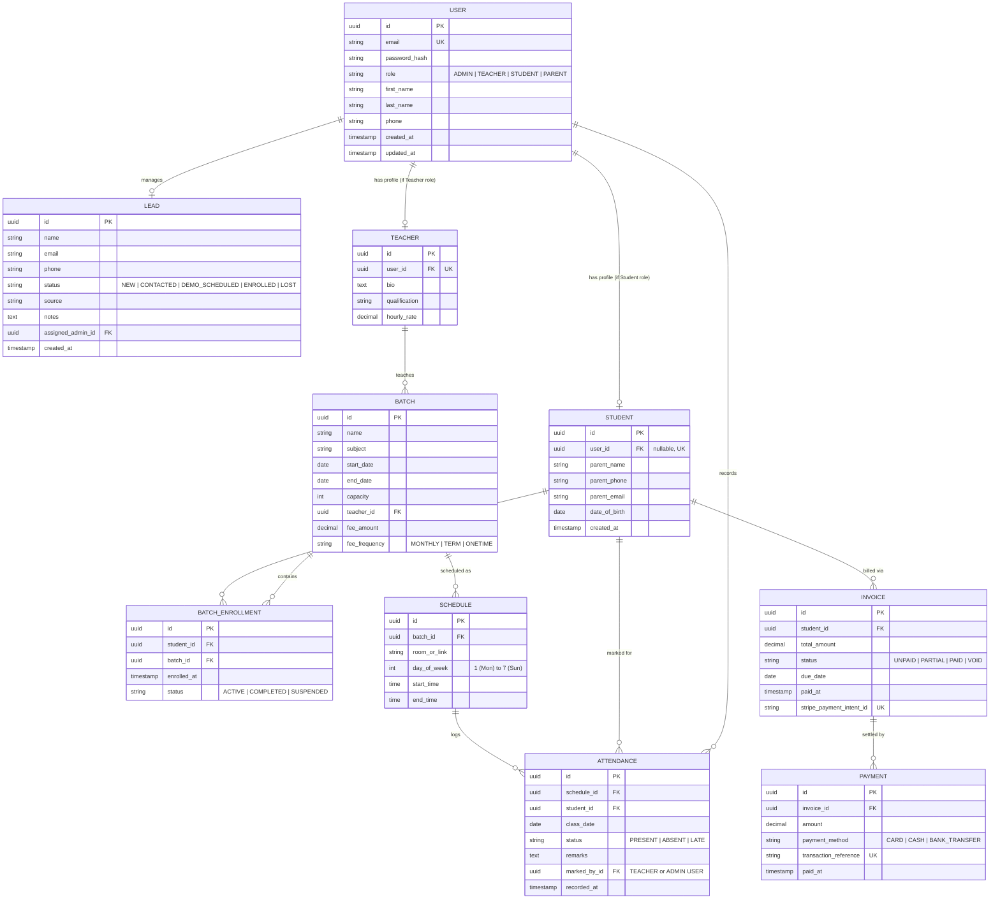

# Database Design Specification
## Project Name: Educational E-CRM & Classes Management System

---

## 1. Document Control
*   **Version**: 1.0.0
*   **Status**: Draft
*   **Authors**: Antigravity AI & Dharmendra

---

## 2. Entity Relationship Diagram (ERD)

The relational schema for the E-CRM system handles roles, academic enrollment scheduling, attendance metrics, billing invoices, and CRM lead records.

---

## 3. Schema Definitions & Table Specifications

### 3.1. Users Table (`users`)
Stores base credentials and details for all user types.
*   `id`: `UUID` (Primary Key, default `gen_random_uuid()`)
*   `email`: `VARCHAR(255)` (Unique, Indexed, Case-Insensitive)
*   `password_hash`: `VARCHAR(255)` (Bcrypt hashed)
*   `role`: `VARCHAR(50)` (Constraint: `role IN ('ADMIN', 'TEACHER', 'STUDENT', 'PARENT')`)
*   `first_name`: `VARCHAR(100)`
*   `last_name`: `VARCHAR(100)`
*   `phone`: `VARCHAR(20)` (Optional)
*   `created_at`: `TIMESTAMP` (Default `NOW()`)
*   `updated_at`: `TIMESTAMP` (Default `NOW()`)

### 3.2. Leads Table (`leads`)
Tracks sales pipeline inquiries.
*   `id`: `UUID` (Primary Key)
*   `name`: `VARCHAR(255)`
*   `email`: `VARCHAR(255)`
*   `phone`: `VARCHAR(20)`
*   `status`: `VARCHAR(50)` (Constraint: `status IN ('NEW', 'CONTACTED', 'DEMO_SCHEDULED', 'ENROLLED', 'LOST')`)
*   `source`: `VARCHAR(100)` (e.g., 'Web Form', 'Referral', 'Facebook Ad')
*   `notes`: `TEXT` (Optional logs of interaction)
*   `assigned_admin_id`: `UUID` (Foreign Key -> `users(id)`, nullable)
*   `created_at`: `TIMESTAMP` (Default `NOW()`)

### 3.3. Students Table (`students`)
Extended attributes for users acting as students.
*   `id`: `UUID` (Primary Key)
*   `user_id`: `UUID` (Foreign Key -> `users(id)`, Unique, Nullable. Accounts can exist before online portal activation).
*   `parent_name`: `VARCHAR(200)`
*   `parent_phone`: `VARCHAR(20)`
*   `parent_email`: `VARCHAR(255)`
*   `date_of_birth`: `DATE`
*   `created_at`: `TIMESTAMP` (Default `NOW()`)

### 3.4. Teachers Table (`teachers`)
*   `id`: `UUID` (Primary Key)
*   `user_id`: `UUID` (Foreign Key -> `users(id)`, Unique)
*   `bio`: `TEXT` (Optional)
*   `qualification`: `VARCHAR(255)`
*   `hourly_rate`: `NUMERIC(10, 2)` (For administrative payroll reports)

### 3.5. Batches Table (`batches`)
*   `id`: `UUID` (Primary Key)
*   `name`: `VARCHAR(100)` (e.g., 'Grade 10 Algebra A')
*   `subject`: `VARCHAR(100)`
*   `start_date`: `DATE`
*   `end_date`: `DATE`
*   `capacity`: `INT`
*   `teacher_id`: `UUID` (Foreign Key -> `teachers(id)`)
*   `fee_amount`: `NUMERIC(10, 2)`
*   `fee_frequency`: `VARCHAR(50)` (Constraint: `fee_frequency IN ('MONTHLY', 'TERM', 'ONETIME')`)

### 3.6. Batch Enrollments Table (`batch_enrollments`)
Matches students with batches they attend.
*   `id`: `UUID` (Primary Key)
*   `student_id`: `UUID` (Foreign Key -> `students(id)`)
*   `batch_id`: `UUID` (Foreign Key -> `batches(id)`)
*   `enrolled_at`: `TIMESTAMP` (Default `NOW()`)
*   `status`: `VARCHAR(50)` (Constraint: `status IN ('ACTIVE', 'COMPLETED', 'SUSPENDED')`)
*   *Unique Constraint*: Unique index on `(student_id, batch_id)` to prevent double enrollments.

### 3.7. Schedules Table (`schedules`)
Weekly timetable rules for recurring classes.
*   `id`: `UUID` (Primary Key)
*   `batch_id`: `UUID` (Foreign Key -> `batches(id)`, CASCADE delete)
*   `room_or_link`: `VARCHAR(255)`
*   `day_of_week`: `INT` (Range: `1` to `7`)
*   `start_time`: `TIME`
*   `end_time`: `TIME`

### 3.8. Attendance Table (`attendance`)
Stores attendance logs for individual sessions.
*   `id`: `UUID` (Primary Key)
*   `schedule_id`: `UUID` (Foreign Key -> `schedules(id)`)
*   `student_id`: `UUID` (Foreign Key -> `students(id)`)
*   `class_date`: `DATE`
*   `status`: `VARCHAR(50)` (Constraint: `status IN ('PRESENT', 'ABSENT', 'LATE')`)
*   `remarks`: `TEXT` (Optional absence理由 or comments)
*   `marked_by_id`: `UUID` (Foreign Key -> `users(id)`)
*   `recorded_at`: `TIMESTAMP` (Default `NOW()`)
*   *Unique Constraint*: Unique index on `(schedule_id, student_id, class_date)` to prevent duplicate marking.

### 3.9. Invoices Table (`invoices`)
*   `id`: `UUID` (Primary Key)
*   `student_id`: `UUID` (Foreign Key -> `students(id)`)
*   `total_amount`: `NUMERIC(10, 2)`
*   `status`: `VARCHAR(50)` (Constraint: `status IN ('UNPAID', 'PARTIAL', 'PAID', 'VOID')`)
*   `due_date`: `DATE`
*   `paid_at`: `TIMESTAMP` (Nullable)
*   `stripe_payment_intent_id`: `VARCHAR(255)` (Unique, Nullable)

### 3.10. Payments Table (`payments`)
*   `id`: `UUID` (Primary Key)
*   `invoice_id`: `UUID` (Foreign Key -> `invoices(id)`)
*   `amount`: `NUMERIC(10, 2)`
*   `payment_method`: `VARCHAR(50)` (Constraint: `payment_method IN ('CARD', 'CASH', 'BANK_TRANSFER')`)
*   `transaction_reference`: `VARCHAR(255)` (Unique, Nullable)
*   `paid_at`: `TIMESTAMP` (Default `NOW()`)

---

## 4. Indexing & Optimization Strategy

To ensure queries remain efficient as tables scale:
*   **Foreign Key Indexes**: Postgre SQL does not index foreign keys by default. Explicitly add indexes on all foreign key columns (e.g. `batch_enrollments(student_id)`, `attendance(student_id)`, `invoices(student_id)`).
*   **Timetable Lookups**: Create a composite index on `schedules(day_of_week, start_time, end_time)` to quickly query daily calendar maps.
*   **Lead Pipeline Filters**: Create an index on `leads(status, created_at)` to support rendering the Kanban board sorted by creation date.
*   **Case Insensitive email indices**: Create unique index `CREATE UNIQUE INDEX users_email_lower_idx ON users (LOWER(email));`
