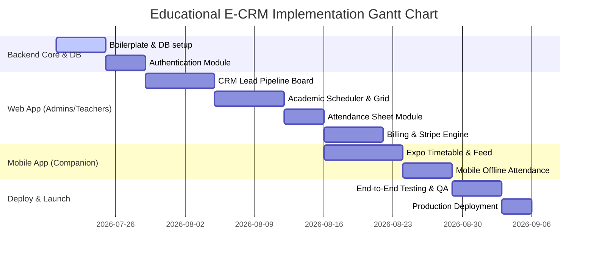

# Implementation & Project Plan
## Project Name: Educational E-CRM & Classes Management System

---

## 1. Document Control
*   **Version**: 1.0.0
*   **Status**: Draft
*   **Authors**: Antigravity AI & Dharmendra

---

## 2. Project Roadmap & Key Milestones

The project will progress in structured iterations, building the backend core and web management modules before developing mobile companion interfaces.

---

## 3. Detailed Phase Breakdowns

### Phase 1: Foundation Setup (Milestone 1)
*   **Objective**: Initialize base code repositories, database connections, and CI/CD validation gates.
*   **Deliverables**:
    *   Express API base template with TypeScript, Winston logging, and Prisma ORM configuration.
    *   PostgreSQL database hosted on Neon/Supabase with initial schema migrations run.
    *   Vite + React web boilerplate configured with design system variables (`index.css`).

### Phase 2: CRM & Authentication Core (Milestone 2)
*   **Objective**: Implement core login logic and lead-tracking capabilities.
*   **Deliverables**:
    *   JWT authentication routes (`POST /auth/login`, `POST /auth/refresh`).
    *   Admins-only CRUD middleware in the API.
    *   Web CRM Kanban board with drag-and-drop actions updating the server DB state instantly.
    *   Public-facing HTML code builder to copy/paste Lead Inquiry forms into marketing websites.

### Phase 3: Academic Scheduler & Attendance Engine (Milestone 3)
*   **Objective**: Establish class creation tools and daily logs.
*   **Deliverables**:
    *   Class Batch manager forms and active calendar grid (preventing double-bookings).
    *   Attendance log sheet page.
    *   Automated notification worker using Twilio (SMS) / SendGrid (Email) to dispatch alerts to parents on student absence.

### Phase 4: Billing Engine (Milestone 4)
*   **Objective**: Automate invoicing and integrate Stripe card checkouts.
*   **Deliverables**:
    *   Monthly billing CRON worker generating invoices automatically based on active student enrollments.
    *   Stripe payment session API integration.
    *   Stripe Webhook router to flag invoice payment status as `PAID` upon transaction completion.

### Phase 5: Companion Mobile App Development (Milestone 5)
*   **Objective**: Build a cross-platform Expo React Native app focused on teachers, students, and parents.
*   **Deliverables**:
    *   Expo project routing configured with Expo Router.
    *   Teacher Quick Attendance grid with SQLite local caching for offline capability.
    *   Parent/Student bulletin feed showing class updates, invoice balances, and push notifications (via Expo Push Notification service).

### Phase 6: QA, Polish & Deployment (Milestone 6)
*   **Objective**: Validate integration interfaces and launch live.
*   **Deliverables**:
    *   API endpoint load testing (using k6).
    *   Production deployment: API to Render/AWS, Web App to Vercel.
    *   Expo Application builds generated via EAS (Expo Application Services) submitted to App Store Connect / Google Play Console testing tracks.

---

## 4. Work Breakdown Structure (WBS) & Tracking Matrix

| Task Code | Description | Platform | Assigned To | Dependency | Status |
| :--- | :--- | :--- | :--- | :--- | :--- |
| `DB-01` | Initialize PostgreSQL schema and Prisma migrations | Backend | Backend Eng | None | `Pending` |
| `AUTH-01`| Write JWT authentication routes and RBAC rules | Backend | Backend Eng | `DB-01` | `Pending` |
| `CRM-01` | Build Lead management board UI | Web App | Frontend Eng| `AUTH-01` | `Pending` |
| `SCHED-01`| Implement weekly timetabling scheduler layout | Web App | Frontend Eng| `CRM-01` | `Pending` |
| `ATT-01` | Build attendance sheets and sync controller | API + Web | Fullstack Eng| `SCHED-01`| `Pending` |
| `PAY-01` | Stripe API integrations and invoice creation | Backend | Backend Eng | `DB-01` | `Pending` |
| `MOB-01` | Create Expo app navigation and auth sync | Mobile | Mobile Eng | `AUTH-01` | `Pending` |
| `MOB-02` | Offline-first attendance sync module | Mobile | Mobile Eng | `ATT-01` | `Pending` |

---

## 5. Verification & Testing Protocol

To ensure system reliability:
1.  **Unit Tests (Backend)**: Written using Jest, checking JWT signature validation, RBAC route blockers, and invoice fee calculation math.
2.  **Integration Testing (API)**: Executed via Supertest to check standard REST flows (e.g. creating a lead successfully records database rows).
3.  **End-to-End Testing (Web)**: Driven via Playwright/Cypress verifying Kanban board drag movements and checkout success screens.
4.  **Device Testing (Mobile)**: Validated on physical iOS and Android devices via Expo Go, simulating offline-to-online network transitions.
